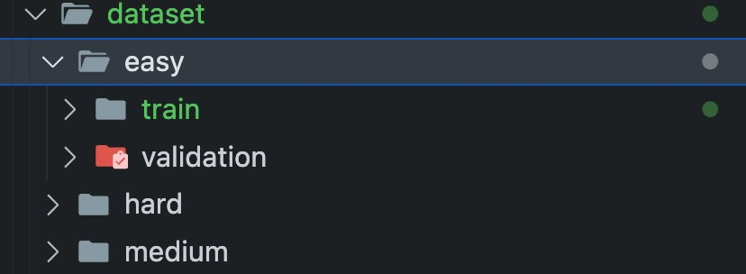

# 运行
1. download the dataset

```bash
wget -O pan24-multi-author-analysis.zip 'https://zenodo.org/records/10677876/files/pan24-multi-author-analysis.zip?download=1'
```

2. unzip the dataset
3. keep the dataset in the same folder as the code 
4. run the code
```bash
bash train.sh
```

# 现象
1. `slurm-6853.out`中是运行的log
2. json中author数和changes数不一致（./dataset/easy/train/truth-problem-1.json）
3. 段落数和changes数不一致，可以看log中1633行的报错
4. 数据分布极不均匀（0/1 分布不均匀）（这可能影响到调参）
- easy 中label为1的比例： train:0.9131378935939196 validation:0.8980169971671388 (模型将label全置为1，此时acc为0.898)
- medium 中label为1的比例： train:0.5702351061401506 validation:0.5668554006968641
- hard 中label为1的比例： train:0.46898184688239936 validation:0.45630597918179616

# To-explore
1. 每一阶段8:2的混淆：最简单的方法是，dataset文件夹下新建文件夹，将混淆放入，改变`train.py`中`def data4curriculum_learning`中的categories参数
2. 每一阶段的数据分布不均匀：改变采样（进行resample后方法同1） or 改变patience
3. 改变backbone，只用改变`model_type`参数
4. 改变lr,decay,optimizer等参数
